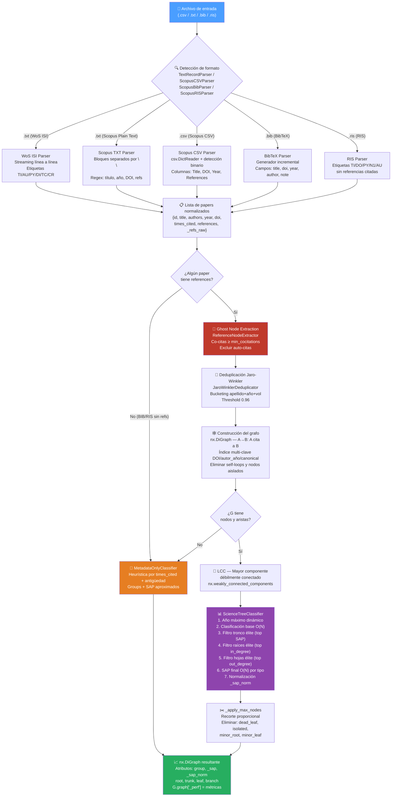

# 🌳 Árbol de la Ciencia — `science_tree_builder.py`

> **Tree of Science (ToS)** es una herramienta bibliométrica que transforma exportaciones de bases de datos académicas (Scopus / Web of Science) en un **grafo de citaciones clasificado**, donde cada artículo científico queda posicionado como raíz, tronco o hoja del árbol del conocimiento.

---

## Tabla de contenidos

1. [Concepto](#concepto)
2. [Arquitectura del sistema](#arquitectura-del-sistema)
3. [Componentes principales](#componentes-principales)
4. [Pipeline completo (diagrama de flujo)](#pipeline-completo-diagrama-de-flujo)
5. [Clasificación de nodos](#clasificación-de-nodos)
6. [Puntuación SAP](#puntuación-sap)
7. [Nodos Fantasma (Ghost Nodes)](#nodos-fantasma-ghost-nodes)
8. [Formatos de entrada soportados](#formatos-de-entrada-soportados)
9. [Uso desde CLI](#uso-desde-cli)
10. [Uso como librería Python](#uso-como-librería-python)
11. [Atributos del grafo resultante](#atributos-del-grafo-resultante)
12. [Historial de versiones](#historial-de-versiones)

---

## Concepto

La metáfora del árbol de la ciencia se basa en la **posición estructural** que ocupa cada artículo dentro del grafo de citaciones:

| Parte del árbol | Rol científico                       | Criterio estructural                            |
|-----------------|--------------------------------------|-------------------------------------------------|
| **Raíces**      | Artículos fundacionales              | Reciben citas pero no citan a nadie (`out = 0`) |
| **Troncos**     | Artículos estructurales / puentes    | Reciben y emiten citas (`in > 0, out > 0`)      |
| **Hojas**       | Frente de investigación actual       | Solo citan, nadie los cita aún (`in = 0`)       |

La convención del grafo es **A → B = "A cita a B"**, lo que invierte la intuición habitual: las raíces son los *sinks* (artículos muy citados, sin referencias hacia atrás) y las hojas son los *sources* (artículos recientes, con muchas referencias).

---

## Arquitectura del sistema

```
science_tree_builder.py
│
├── _STOP (frozenset)             — Stopwords para IDs canónicos
├── _generate_canonical_id()      — Generador de IDs sin DOI
│
├── PARSERS (capa de entrada)
│   ├── TextRecordParser          — WoS ISI + Scopus Plain Text (.txt)
│   ├── ScopusCSVParser           — Scopus exportación CSV (.csv)
│   ├── ScopusBibParser           — Scopus BibTeX (.bib)
│   └── ScopusRISParser           — Scopus RIS (.ris)
│
├── DEDUPLICACIÓN
│   └── JaroWinklerDeduplicator   — Fusión tipográfica con bucketing O(n·k)
│
├── ENRIQUECIMIENTO
│   └── ReferenceNodeExtractor    — Extracción de ghost nodes
│
├── CLASIFICACIÓN
│   ├── ScienceTreeClassifier     — Clasificación estructural O(N) + SAP
│   └── MetadataOnlyClassifier    — Fallback sin referencias (BIB/RIS)
│
└── ORQUESTADOR
    └── ScienceTreeBuilder        — Pipeline completo, punto de entrada
```

---

## Componentes principales

### `TextRecordParser`
Parser híbrido para archivos `.txt`. Detecta automáticamente si el archivo proviene de **Web of Science** (formato ISI Tagged) o de **Scopus Plain Text**. Usa streaming línea a línea para el path WoS (O(1) de memoria por línea).

### `ScopusCSVParser`
Parsea exportaciones CSV de Scopus. Detecta el modo binario/texto por comportamiento (compatible con Django `FieldFile`, `BytesIO` y archivos estándar). Maneja el BOM UTF-8 (`utf-8-sig`) que Scopus inserta en Windows.

### `ScopusBibParser`
Parsea archivos BibTeX exportados por Scopus. Usa un generador incremental con `re.finditer` para procesar entradas sin cargar todo el archivo en memoria. A diferencia del estándar BibTeX, el BIB de Scopus generalmente **no exporta referencias**, por lo que el campo `references` queda vacío y activa el modo fallback.

### `ScopusRISParser`
Parsea archivos RIS exportados por Scopus. El formato RIS estándar de Scopus tampoco incluye referencias citadas.

### `JaroWinklerDeduplicator`
Fusiona variantes tipográficas de la misma referencia. Implementa **Jaro-Winkler puro** (sin dependencias externas) con una estrategia de bucketing que reduce la complejidad de O(n²) a O(n·k). Los *guards* DOI/año/volumen previenen fusiones erróneas.

### `ReferenceNodeExtractor`
Extrae metadatos de un string de referencia crudo para crear un **ghost node** — un nodo mínimo que permite preservar la conectividad histórica del árbol sin que el artículo esté en el corpus original.

### `ScienceTreeClassifier`
El núcleo bibliométrico. Clasifica cada nodo del grafo en 8 grupos posibles y calcula el **SAP** (ver sección dedicada). Admite dos modos de cálculo: fast O(N) (por defecto) y BFS O(V+E) (mayor fidelidad al ToS original).

### `MetadataOnlyClassifier`
Clasificador de respaldo que activa cuando el corpus no tiene referencias. En lugar de usar la posición estructural en el grafo, usa heurísticas basadas en `times_cited` y antigüedad del paper.

### `ScienceTreeBuilder`
El orquestador principal. Conecta todos los componentes en el pipeline completo y expone el único método público que los usuarios necesitan: `build_from_file()`.

---

## Pipeline completo (diagrama de flujo)



---

## Clasificación de nodos

El clasificador produce **8 grupos** para cada nodo. Los 4 visibles forman el árbol final; los 4 ocultos quedan excluidos del grafo de visualización:

### Grupos visibles

| Grupo      | Criterio estructural                                                    | SAP final       |
|------------|-------------------------------------------------------------------------|-----------------|
| `root`     | `out = 0`, `in > 0`, top-N por `in_degree`                             | `in_degree`     |
| `trunk`    | `in > 0`, `out > 0`, top-N por `in × out`                              | `in × out`      |
| `branch`   | `in > 0`, `out > 0`, fuera del top-N trunk                             | `in × out`      |
| `leaf`     | `in = 0`, `out > 0`, `año ≥ año_max - leaf_window`, top-N por `out`   | `out_degree`    |

### Grupos ocultos

| Grupo        | Criterio                                                                 |
|--------------|--------------------------------------------------------------------------|
| `minor_root` | `out = 0`, `in > 0`, fuera del top-N raíces (menor impacto)             |
| `minor_leaf` | `in = 0`, `out > 0`, año reciente, fuera del top-N hojas                |
| `dead_leaf`  | `in = 0`, `out > 0`, `año < año_max - leaf_window` (hoja antigua)       |
| `isolated`   | `in = 0`, `out = 0` (sin aristas — raro tras filtro LCC)                |

---

## Puntuación SAP

El **SAP** (Score de Árbol de la Ciencia, análogo al "flujo de savia") cuantifica la importancia de cada nodo según su posición en el árbol:

```
SAP (roots)         = in_degree           → cuánto cita el corpus a este fundacional
SAP (trunk/branch)  = in_degree × out_degree → proxy del flujo estructural
SAP (leaves)        = out_degree          → amplitud del frente de investigación
SAP (isolated)      = 0
```

### Modo fast (O(N)) — defecto

Calcula el SAP directamente a partir de los grados. Recomendado para corpus grandes.

### Modo BFS (O(V+E)) — `fast_sap=False`

Usa búsqueda en amplitud para calcular cuántas raíces puede alcanzar cada hoja y cuántas hojas son accesibles desde cada tronco. Mayor fidelidad al algoritmo ToS original, pero más lento en corpus extensos.

---

## Nodos Fantasma (Ghost Nodes)

Un **ghost node** es un artículo que:
- **No está** en el archivo exportado original.
- **Sí aparece** en las listas de referencias de uno o más papers del corpus.
- Es **co-citado** por al menos `min_cocitations` papers.

Al añadirlo al grafo, las raíces fundacionales que los investigadores no exportaron explícitamente siguen siendo alcanzables como nodos conectados, preservando la integridad histórica del árbol.

**Atributos distintivos de un ghost node:**
```python
{
    "_is_ghost": True,
    "times_cited": 0,
    "references": [],
    "source": "wos_reference"  # o "csv_reference"
}
```

**Umbral de co-citación (`min_cocitations`):**
- Si se pasa explícitamente → se usa ese valor.
- Si es `None` → auto-escala: `max(4, corpus_size // 50)`.

---

## Formatos de entrada soportados

| Extensión | Fuente                       | Referencias | Notas                                             |
|-----------|------------------------------|-------------|---------------------------------------------------|
| `.csv`    | Scopus CSV                   | ✅ Completas | Columna `References` separada por `;`             |
| `.txt`    | Web of Science ISI           | ✅ Completas | Etiqueta `CR`, streaming O(1)                     |
| `.txt`    | Scopus Plain Text            | ✅ Completas | Bloques separados por línea en blanco              |
| `.bib`    | Scopus BibTeX                | ⚠️ Parciales | BIB estándar no exporta refs; fallback metadata   |
| `.ris`    | Scopus RIS                   | ❌ Vacías   | Formato no incluye referencias; fallback metadata |

---

## Uso desde CLI

```bash
# Uso básico
python science_tree_builder.py mi_corpus.csv

# Con parámetros avanzados
python science_tree_builder.py mi_corpus.txt 3 \
    --window=7 \
    --trunk-limit=15 \
    --root-limit=20 \
    --leaf-limit=30

# Modo BFS (mayor fidelidad, más lento)
python science_tree_builder.py mi_corpus.csv --slow-sap
```

**Argumentos:**

| Argumento           | Descripción                                             | Default |
|---------------------|---------------------------------------------------------|---------|
| `archivo`           | Ruta al archivo bibliográfico (posicional, obligatorio) | —       |
| `min_cocitations`   | Umbral de co-citas para ghost nodes (posicional)        | auto    |
| `--slow-sap`        | Activa modo BFS O(V+E) en lugar de O(N)                 | False   |
| `--window=N`        | Ventana temporal en años para hojas activas             | 5       |
| `--trunk-limit=N`   | Máximo de troncos visibles                              | 20      |
| `--root-limit=N`    | Máximo de raíces visibles                               | 20      |
| `--leaf-limit=N`    | Máximo de hojas visibles                                | 25      |

**Salida JSON de ejemplo:**
```json
{
  "total_nodes": 87,
  "total_edges": 312,
  "groups": { "root": 20, "trunk": 15, "branch": 32, "leaf": 20 },
  "hidden_groups": { "minor_root": 8, "minor_leaf": 12, "dead_leaf": 5 },
  "sap_max": 144,
  "sap_avg": 23.4,
  "performance": {
    "total_s": 1.23,
    "parse_s": 0.08,
    "ghost_jw_s": 0.52,
    "build_graph_s": 0.11,
    "classify_sap_s": 0.04,
    "sap_mode": "fast_O(N)"
  }
}
```

---

## Uso como librería Python

```python
from science_tree_builder import ScienceTreeBuilder

# Configuración estándar
builder = ScienceTreeBuilder(
    min_cocitations=None,       # auto-escala según tamaño del corpus
    fast_sap=True,              # O(N) — recomendado
    use_lcc=True,               # filtrar por mayor componente conectado
    leaf_window=5,              # hojas activas: últimos 5 años
    top_trunk_limit=20,         # máximo de troncos visibles
    top_root_limit=20,          # máximo de raíces visibles
    top_leaf_limit=25,          # máximo de hojas visibles
    max_nodes=90,               # recorte proporcional del grafo final
    include_ghost_nodes=True,   # activar ghost nodes
    exclude_self_citations=True,# excluir auto-citas
    use_jaro_winkler=True,      # deduplicación tipográfica
)

G = builder.build_from_file("mi_corpus.csv")

# Acceder a los nodos clasificados
for node_id, data in G.nodes(data=True):
    print(f"{data['group']:10} | SAP={data['_sap']:4} | {data['label'][:50]}")

# Ver métricas de rendimiento
perf = G.graph["_perf"]
print(f"Pipeline completo: {perf['total_s']}s")
print(f"Ghost nodes añadidos: {perf['total_papers'] - perf['corpus_papers']}")
```

---

## Atributos del grafo resultante

### Atributos de nodo

| Atributo       | Tipo       | Descripción                                                     |
|----------------|------------|-----------------------------------------------------------------|
| `group`        | `str`      | Clasificación: `root`, `trunk`, `branch`, `leaf`, ...           |
| `_sap`         | `int/float`| Puntuación SAP absoluta                                         |
| `_sap_norm`    | `float`    | SAP normalizado en [0, 1]                                       |
| `root`         | `int/float`| Score raíz (compatibilidad legacy)                              |
| `trunk`        | `int/float`| Score tronco (compatibilidad legacy)                            |
| `leaf`         | `int/float`| Score hoja (compatibilidad legacy)                              |
| `branch`       | `int/float`| Score rama                                                      |
| `total_value`  | `int/float`| Suma total de scores                                            |
| `_is_ghost`    | `bool`     | `True` si el nodo no está en el corpus original                 |
| `label`        | `str`      | Título del paper (para visualización)                           |
| `authors`      | `list`     | Lista de autores                                                |
| `year`         | `int`      | Año de publicación                                              |
| `doi`          | `str/None` | DOI del paper                                                   |
| `times_cited`  | `int`      | Veces citado según la fuente                                    |
| `source`       | `str`      | Origen: `wos`, `scopus_csv`, `scopus_bib`, `scopus_ris`, ...   |

### Metadatos del grafo (`G.graph`)

| Clave       | Tipo   | Descripción                                      |
|-------------|--------|--------------------------------------------------|
| `_perf`     | `dict` | Métricas detalladas de rendimiento del pipeline  |

---

## Historial de versiones

| Versión | Cambios principales                                                             |
|---------|---------------------------------------------------------------------------------|
| v1      | Algoritmo base con ghost nodes                                                  |
| v2      | Labels enriquecidos `V:P`, exclusión de auto-citas                              |
| v3      | SAP real BFS O(V+E), Jaro-Winkler puro, `graph.simplify()`                     |
| v4      | Bucketing JW (apellido+año+vol/pág), fix Django CSV parser                      |
| v5      | `_generate_canonical_id`, filtro LCC, SAP O(N) fast_sap, streaming BIB         |
| v6      | Clasificación temporal de hojas (`leaf_window`), `dead_leaf`                   |
| v7      | Tronco de élite (`top_trunk_limit`), grupos `branch`                           |
| v7.1    | HOTFIX: SAP correcto por tipo de nodo (roots→in, leaves→out, trunk→in×out)    |
| v8      | Filtros élite para raíces/hojas: `minor_root`/`minor_leaf`, límites CLI        |
| v9      | FIX `ScopusBibParser._entry`: `references` no hardcodeado como `[]`            |

---

*Documentación generada para `science_tree_builder.py` v9.*