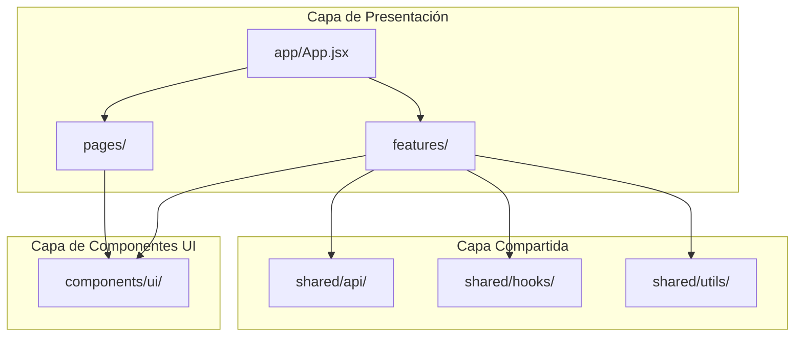
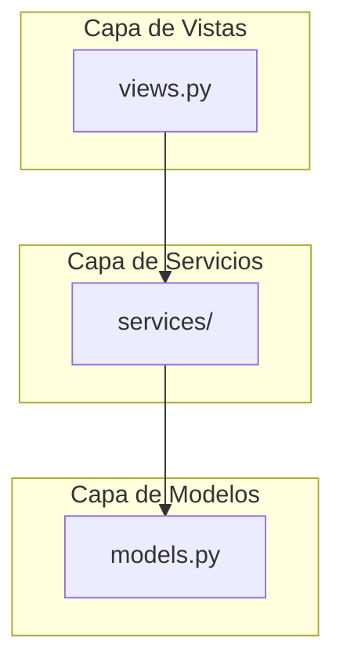

# Plan de Reorganización de Arquitectura - Árbol de la Ciencia

## Estado Actual del Proyecto

### Estructura Actual

```
tree_of_science/
├── authentication/          # App Django de autenticación
├── bibliography/            # App Django de bibliografía
├── tree_of_science/         # Configuración Django
├── trees/                   # App Django de árboles
├── tos_frontend/            # Frontend React/Vite
│   └── src/
│       ├── App.jsx          # ⚠️ 15.8KB - muy grande
│       ├── Page.jsx         # ⚠️ 27.4KB - muy grande
│       ├── components/     # Todos los componentes mezclados
│       ├── hooks/           # Custom hooks
│       └── lib/             # Utilidades
├── e2e-playwright/          # Pruebas E2E
└── testsprite-tos/          # Pruebas unitarias
```

### Problemas Identificados

#### Frontend (React)
| Problema | Archivo | Impacto |
|----------|---------|---------|
| Archivo muy grande | `App.jsx` (15.8KB) | Difícil mantener y entender |
| Archivo muy grande | `Page.jsx` (27.4KB) | Difícil mantener y entender |
| Sin separación por dominio | `components/` | Componentes mezclados |
| Lógica de rutas mezclada | `App.jsx` | Acoplamiento alto |
| Sin estructura de páginas | `components/` | No hay `/pages` separado |

#### Backend (Django)
| Problema | Archivo | Impacto |
|----------|---------|---------|
| Views muy grande | `authentication/views.py` (49KB) | Difícil mantener |
| Lógica de negocio en views | Todas las apps | Acoplamiento alto |
| Sin servicios separados | N/A | Difícil de testear |

---

## Plan de Reorganización

### Fase 1: Reorganizar Frontend (React)

#### 1.1 Estructura de carpetas basada en features

```
tos_frontend/src/
├── app/                     # Configuración de rutas y providers
│   ├── App.jsx              # Archivo limpio de rutas
│   ├── routes.jsx           # Definición de rutas
│   └── providers.jsx        # Providers (Auth, Query, etc.)
│
├── pages/                   # Páginas/componentes de nivel de ruta
│   ├── LandingPage.jsx      # Page.jsx renombrado y dividido
│   ├── LoginPage.jsx
│   ├── RegisterPage.jsx
│   ├── DashboardPage.jsx
│   ├── TreeGeneratorPage.jsx
│   ├── TreeHistoryPage.jsx
│   ├── TreeDetailPage.jsx
│   └── BibliographyPage.jsx
│
├── features/                # Lógica de negocio por dominio
│   ├── auth/                # Feature de autenticación
│   │   ├── components/     # Componentes específicos de auth
│   │   │   ├── LoginForm.jsx
│   │   │   ├── RegisterForm.jsx
│   │   │   └── PasswordReset.jsx
│   │   ├── hooks/          # Hooks específicos de auth
│   │   │   └── useAuth.jsx
│   │   └── api/            # Funciones API de auth
│   │       └── authApi.js
│   │
│   ├── trees/              # Feature de árboles
│   │   ├── components/
│   │   ├── hooks/
│   │   └── api/
│   │
│   ├── bibliography/       # Feature de bibliografía
│   │   ├── components/
│   │   ├── hooks/
│   │   └── api/
│   │
│   └── admin/             # Feature de administración
│       ├── components/
│       ├── hooks/
│       └── api/
│
├── components/             # Componentes UI compartidos (shadcn/ui)
│   └── ui/                 # Componentes base
│
├── shared/                 # Utilidades compartidas
│   ├── api/                # Configuración de API base
│   │   ├── api.js
│   │   └── axios.js
│   ├── hooks/              # Hooks genéricos
│   ├── utils/              # Utilidades
│   └── constants/          # Constantes
│
└── assets/                 # Recursos estáticos
```

#### 1.2 Dividir App.jsx y Page.jsx

**App.jsx actual** → Dividir en:
- `app/App.jsx` - Solo configuración de providers y rutas
- `app/routes.jsx` - Definición de todas las rutas
- `app/providers.jsx` - AuthProvider, QueryClientProvider, etc.

**Page.jsx actual** → Dividir en:
- `pages/LandingPage.jsx` - Página principal
- `pages/auth/` - Componentes de autenticación (Login, Register, etc.)

#### 1.3 Crear estructura de features

Mover componentes de `components/` a `features/{domain}/`:

| Original | Nuevo destino |
|----------|---------------|
| `components/Login.jsx` | `features/auth/components/LoginForm.jsx` |
| `components/Register.jsx` | `features/auth/components/RegisterForm.jsx` |
| `components/Dashboard.jsx` | `features/trees/components/Dashboard.jsx` |
| `components/TreeGenerator.jsx` | `features/trees/components/TreeGenerator.jsx` |
| `components/TreeHistory.jsx` | `features/trees/components/TreeHistory.jsx` |
| `components/TreeDetail.jsx` | `features/trees/components/TreeDetail.jsx` |
| `components/BibliographyManager.jsx` | `features/bibliography/components/BibliographyManager.jsx` |
| `components/admin/*.jsx` | `features/admin/components/*.jsx` |

---

### Fase 2: Reorganizar Backend (Django)

#### 2.1 Estructura de carpetas por app

```
authentication/
├── models.py               # Modelos (mantener)
├── views.py               # ⚠️ Necesita refactorización
├── serializers.py         # Serializers
├── urls.py                # Rutas
├── admin.py               # Admin Django
├── apps.py                # Configuración
│
├── services/              # NUEVO: Lógica de negocio
│   ├── __init__.py
│   ├── auth_service.py    # Lógica de autenticación
│   ├── user_service.py    # Gestión de usuarios
│   └── invitation_service.py
│
├── schemas/               # NUEVO: Esquemas de validación
│   ├── __init__.py
│   └── auth_schemas.py
│
└── utils/                 # NUEVO: Utilidades
    ├── __init__.py
    ├── token_utils.py
    └── email_utils.py
```

#### 2.2 Refactorizar views.py

Extraer lógica de `views.py` a servicios:

```
authentication/views.py (actual 49KB)
    ↓
authentication/services/auth_service.py
authentication/services/user_service.py
authentication/services/invitation_service.py

authentication/views.py (nuevo - solo recibe y envía datos)
```

#### 2.3 Aplicar el mismo patrón a otras apps

```
bibliography/
├── services/
│   ├── bibliography_service.py
│   └── file_parser_service.py
│
trees/
├── services/
│   ├── tree_generator_service.py
│   └── tree_export_service.py
```

---

### Fase 3: Reorganizar Pruebas y Documentación

#### 3.1 Estructura de pruebas

```
tests/
├── unit/                   # Pruebas unitarias
│   ├── authentication/
│   ├── bibliography/
│   └── trees/
│
├── integration/           # Pruebas de integración
│   ├── api/
│   └── services/
│
└── e2e/                   # Pruebas E2E (mover desde e2e-playwright/)
    ├── auth/
    ├── trees/
    └── admin/
```

#### 3.2 Documentación

```
docs/                       # NUEVA CARPETA
├── architecture/           # Documentación de arquitectura
│   ├── overview.md
│   ├── frontend.md
│   └── backend.md
│
├── api/                   # Documentación de API
│   ├── endpoints.md
│   └── authentication.md
│
└── setup/                 # Guías de configuración
    ├── development.md
    └── deployment.md
```

---

## Diagramas de Arquitectura

### Arquitectura Propuesta - Frontend



### Arquitectura Propuesta - Backend



---

## Orden de Implementación Recomendado

### Paso 1: Preparar estructura de carpetas
1. Crear carpetas `pages/`, `features/`, `shared/` en frontend
2. Crear carpetas `services/` en cada app Django

### Paso 2: Refactorizar App.jsx
1. Extraer providers a `app/providers.jsx`
2. Extraer rutas a `app/routes.jsx`
3. Simplificar `App.jsx`

### Paso 3: Mover componentes a features
1. Agrupar componentes por dominio
2. Mover hooks relacionados a cada feature
3. Mover funciones API a cada feature

### Paso 4: Refactorizar backend
1. Crear servicios para autenticación
2. Crear servicios para árboles
3. Crear servicios para bibliografía

### Paso 5: Reorganizar pruebas y docs
1. Mover documentación a carpeta `docs/`
2. Reorganizar pruebas E2E

---

## Notas Adicionales

- Mantener backwards compatibility durante la transición
- Usar imports absolutos para nueva estructura
- Actualizar configuración de ESLint y TypeScript
- Documentar cambios en CHANGELOG.md
